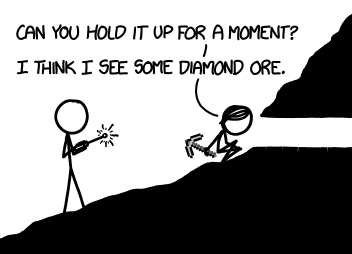
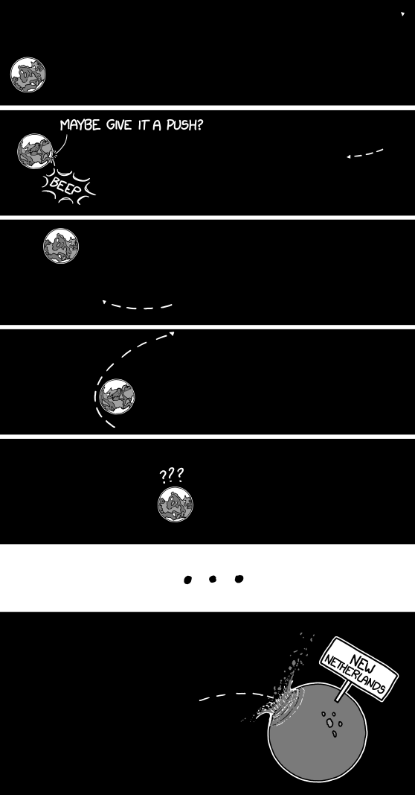

# 扔下一座山
###### 译自: what-if.xkcd.com
### Q? 如果一座巨大的山，比如 Denali，它底部一英寸厚的基座消失了，会怎样？山体下落 1 英寸的撞击会发生什么？1 英尺呢？如果把山的底部抬到现在山顶的高度，然后让整座山落回地面呢？

——John-Clark Levin

***
### A? 一英寸的空隙大约 70 毫秒就会闭合。别把手伸进去。

撞击可能触发地震。Denali（也叫麦金利山）位于阿拉斯加，正好在一条主要断层线以南。这条断层很活跃，而我们知道钻探可以触发地震。地震可能在任何时候发生，所以把一座山从任何高度扔下去，总有可能触发地震。踢一棵树也可能。唯一能确定的方法就是试试看。

假设它没有触发地震，撞击其实不会那么戏剧化。如果你当时站在山上，肯定会感觉到一阵震动，但它可能甚至不足以把你震倒。

山撞上地面时，下面的岩石会受损，但只是一点点。花岗岩基底足够强，能承受一座山巨大的静止重量；下落一英寸造成的冲击波不会在此基础上增加太多压力，岩石会带着少量细裂纹存活。

附近的人肯定能感到撞击，也很可能听到声音；如果你站在山附近，声音大概像一次闪电劈裂声，然后淡成低沉悠长的隆隆声。震动相当于 3.5 级地震；最糟也只是如果你正好住在山旁边，可能震掉墙上几幅画。坦率地说，我会更担心从裂缝里喷出的碎屑。

哦。又是你。

好吧。

从一英尺高落下不会有太大不同。

山会以 2.5 m/s 撞上地面，大约是步行速度。撞击产生的冲击波压力约 50 兆帕，花岗岩能比较轻松地承受。

好。我们直接跳到 John-Clark 问题的最后部分：

从山顶高度落到基底高度，也就是约 5 千米后，这座山会以大约音速运动。

前两次撞击都相当轻微。这一次不会。对地面的冲击会像 7 级地震一样猛烈。不会严格形成陨石坑，但山肯定不再是原来的形状。撞击压力高到足以产生一些不寻常的地质构造。如果你把一块煤放在这颗“流星”下面，撞击足以把它转化成钻石（不幸的是，也会把它砸碎）。

好消息是，Denali 上一次发生 7 级以上地震时没人死亡。希望我们这么做时，山本身上没人。

好。最后一个。

我们需要把山抬出大气层，越过 GPS 卫星轨道，一直到地球引力井最外层边界。然后松手。

它会以每秒 10 千米撞上阿拉斯加。

“最后边疆”不会好过。一个 50 英里宽的陨石坑会抹掉 Denali 国家公园。安克雷奇会被三米厚的碎石掩埋。震动加上落入海洋的碎屑，会在太平洋引发海啸。整个北美大陆都会颤抖。一股风会从西北席卷而来。天空会变暗。

1815 年，坦博拉火山爆发，是有记录以来最大的火山事件。由此形成的全球气溶胶幕让 1816 年成为“无夏之年”。6 月马萨诸塞下雪，8 月宾夕法尼亚河流结冰，霜冻杀死了大多数春季作物。降温效应持续了好几年。

阿拉斯加撞击会糟糕得多。接下来几个月，全球天空充满尘埃。夏天取消，冬天到来。全球气温会下降 5 到 20 摄氏度，并保持一年或更久。

好的一面是，我们不会被全球火风暴吞没。6500 万年前，希克苏鲁伯彗星撞上尤卡坦半岛，把熔融碎屑炸入太空。这些碎屑落回全球各地，给大气加热并点燃全球火风暴。它们可能在大灭绝中起了作用。

不过，我们这座山只有希克苏鲁伯撞击体约 10% 的能量，也就是说它无法点燃全球火风暴。事实上，火风暴只会覆盖北美部分地区。所以真令人宽慰。

北半球会被冰覆盖，但我们这个物种大概能一瘸一拐地挺过去。另一方面，文明很可能崩溃。现代文明完全崩溃会严重打击本来就迟缓的经济，经济损失可能达到每年 80 万亿美元（所有人类商品和服务的总价值）。总的来说，这会对即将到来的选举产生严重影响。

就这样。我们已经把山从能扔下的最高处扔下来了，我希望 John-Clark 为造成的毁灭感到自豪。感谢阅读，然后——

不，那其实说不通。地球引力不会——

从更高处扔不会有用；不会有足够的力把它拉向——

好吧。行。你赢了。我们试试。

糟糕。
