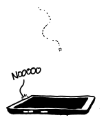
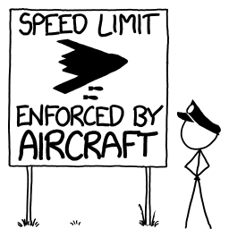

# 雷达强制执法
###### Enforced by Radar
### Q．我有时会在限速标志上看到“雷达执法”，于是忍不住想问：无线电波要强到什么程度，才能阻止一辆车超速？如果真这么做，会发生什么？

——joausc

***
### A．无线电波会对物体施加力。

力并不大。普通手机发射器对周围环境施加的压力大约只有十亿分之一牛顿。这意味着要让几万亿部手机合力，才能用辐射压力托起一片雪花；一部手机产生的压力甚至不能让雪花的速度出现可测量的减小。

如果手机真的能输出足够的能量，用辐射压力托起一片雪花，那么穿过雪花的功率（几千瓦）会很快让雪花变成雨滴，雨滴又会很快变成水蒸气，而水蒸气很快就会成为你所有问题里最不重要的那个。

雪花的命运暗示了我们的汽车会遇到什么问题。

如果你想用辐射压力让一辆一吨重的汽车减速，你的雷达枪需要向它输送大约 2 万亿焦耳的辐射，也就是一枚小型核武器的能量[^1]。而雷达枪实际发出的能量还要更多，因为并不是所有辐射都会被汽车吸收（或反射）[^2]。

你的雷达枪还会把汽车汽化。从某种意义上说，这是个问题；但从另一种意义上说，它也是解决方案。即使大部分能量被反射，吸收的那部分也会把汽车材料变成气体或等离子体。膨胀的云团会对汽车施加远大于辐射本身的压力[^3]。这很方便，因为它意味着我们不需要像只靠辐射压力那样多的能量，就能让汽车停下来。

还有一些更简单的办法可以用辐射让汽车减速。比如，你可以把辐射束瞄准轮胎并把它们融化，或者用电磁辐射摧毁汽车的电气系统。再或者，直接用激光笔晃瞎司机，指望他们下意识减速。

当然，你其实不需要这些东西。如果你的目标是让车慢下来，而不是抓超速司机，你的雷达枪根本不需要任何功率。你只要站在路边警车旁，手里拿一把假雷达枪就行。

归根结底，一把能通过辐射压力让汽车减速的雷达枪，大致相当于一件核武器；用核打击回应交通违法大概有点过火。严格按字面说，它会有效，但它也会摧毁违法者、汽车、警察、道路，以及周围数英里内的所有其他车辆[^4]。

当然，也许并不需要真正使用末日雷达枪；只要威胁要对司机进行核打击，大概就足以吓阻超速了。

这么一想，也许你有时看到的另一种标志，暗示的就是这件事。

[^1]:算出这个量的公式很简单：所需能量等于期望的速度变化（比如 20 英里/小时）乘以汽车质量，再乘以光速。
[^2]:有一部分被反射这件事反而会让问题简单些，因为反射会让辐射传递的动量翻倍。这就是为什么简单太阳帆是白色而不是黑色。想了解材料的雷达反射率，可以看看[我见过扫描质量最糟糕的 PDF 之一](http://www.dtic.mil/dtic/tr/fulltext/u2/601365.pdf)。
[^3]:这个过程叫[烧蚀](https://en.wikipedia.org/wiki/Laser_ablation)，也是《What If》第 13 期里让月球消失的那种机制。
[^4]:它还会导致司机的碎片同时向各个方向违反限速。
