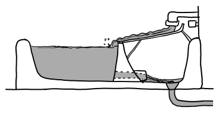
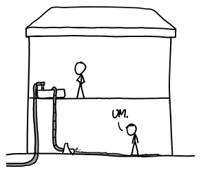
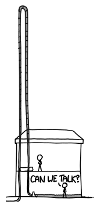
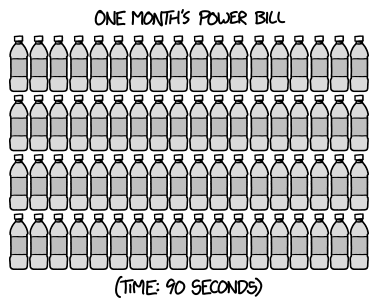

# 水龙头发电
###### Faucet Power
### Q．我刚搬进新公寓。这里包含热水，但电费要我自己付。所以作为一个预算紧张的人……我该怎样最好地利用免费的水龙头来发电？

——David Axel Kurtz

***
### A．你可以在浴缸里建一个微型水电站。

它确实能发电，只是发不了多少。功率公式是压力乘以流量[^1]。由于浴缸很浅，底部压力并不高，所以算下来大约只有 2 瓦，或者说每月约 25 美分。

如果你提高通过发电机的水压，就能获得更多功率。要做到这一点，可以增加水深。如果你的公寓有两层，你可以让水柱从二楼延伸到一楼，产生至少十倍的压力和十倍的功率[^2]。实际上，地方政府花钱把水泵到你的公寓，而你在让水流回去时取回了其中一部分能量。

你能不能用水龙头把水泵到任意高处，然后在水落下来时获得越来越多的功率？

不能。首先，你没法把水泵到任意高。家用水龙头的水压大约是 4 个大气压[^3]。每个大气压大约能把水抬高 10 米，这意味着家用水龙头只能把水抬高大约 40 米。

其次，看看上图你大概也能猜到，利用水压把水泵高 40 米再让它流下来，并没有完成什么事情。你完全可以直接把水龙头接到你的装置上，让水压直接驱动发电机。无论哪种方式，对浴缸水龙头来说，结果都接近 200 瓦，也就是每月 25 美元。

你得确保你的管道能处理这些水。如果排水管堵住不排水，水龙头几天内就能把你的房子灌满。不管怎样，最终大概会有市政部门的人上门，问你为什么每天要用掉 40 吨水。

而且说真的，加州正经历[史上最严重的干旱](http://www.wunderground.com/news/sierra-snowpack-after-photos-20140226)，这个系统可能会为你招来一些嫌弃的目光。当然，如果你住得离加州很远，你的水本来也不会拿去缓解他们的干旱；但为了省几美元电费而浪费巨量水资源（还投入一大笔钱），看起来还是有点不礼貌。

浴缸水龙头的流量比河流小五六个数量级，但它仍然是很多水。我们能不能把它用在不那么自私的地方？

有一种常见建议说，人每天应该喝 8 杯水。没人真正知道这条建议从哪里来；有人声称你每天应该喝 2 到 12 杯水不等[^4]，而这些说法都没有[真正证据](http://www.mayoclinic.org/healthy-living/nutrition-and-healthy-eating/in-depth/water/art-20044256)支撑。我听过唯一真正扎实的建议是：如果你渴了，就喝点水。

如果我们坚持“每天 8 杯水”的标准，那么一个浴缸水龙头就能提供足够的饮用水，无限期维持大约 10000 人。换句话说，只靠 150 个浴缸水龙头，曼哈顿市就能活下去。

但如果你的目标是省电费，还有一个利润高得多的选择。

单瓶瓶装水半升能卖一两美元。很多瓶装水来自[市政水源](https://www.foodandwaterwatch.org/water/bottled/bottled-water-illusions-of-purity/)，也就是说，它就是自来水。瓶装水卖的不一定是水本身；人们常常是在为便利付费，或者因为他们的供水出了问题。不管原因是什么，都没有理由让可口可乐拿走所有利润。

如果你把浴缸水龙头流出的水装瓶，并且能以每瓶 1.50 美元卖掉，你每分钟能赚 72 美元，也就是每年 3800 万美元。

这样你就不用担心电费了。

[^1]:或者换一种说法，流量乘以密度再乘以高度。
[^2]:这类似于第 23 篇文章里讨论过的雨水方案。
[^3]:60 PSI。如果你用旧气压计测量管道系统，这大约是 4000 毫巴。
[^4]:出于某种原因，这种说法总是用偶数；网页搜索会出现大量每天六杯或八杯的建议，却很少有人建议你喝七杯。
