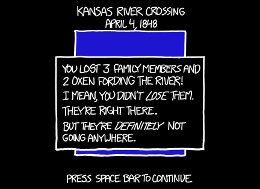

# 冰封河流
###### Frozen Rivers
### Q．如果美国所有河流在夏季正中瞬间结冰，会发生什么？

——Zoe Cutler

***
### A．这是另一个结果比我预期还糟的问题。

首先，水里的几乎每一种动物都会死亡。这会彻底消灭好几种鱼类（[这个网站](http://wwf.panda.org/about_our_earth/ecoregions/lower_mississippi_river.cfm)列出了一些只生活在密西西比河及其支流中的物种），并严重伤害许多其他物种。

然后，所有冰都会开始融化。融化冰需要大量热能，但在这个情景中，冰会以细长条状分布在全国各地，所以它们都会相当快地融化[^1]。这会造成一些局部空气降温，但与环境整体能量预算相比，我们讨论的热能相对很小[^2]。

我们可以用[冰山融化速率](http://journals.ametsoc.org/doi/pdf/10.1175/1520-0485%281980%29010%3C1681%3AOTEOAI%3E2.0.CO%3B2)数据来估计单条河流融化得有多快。除了最寒冷的地区，小溪会在几天内融化，而大河中的冰需要更久。

但在那之前，事情会变得很奇怪。

为了帮我回答这个问题，我请教了 [Charlie Hohn](http://coyot.es/slowwatermovement)，一位对河流行为感兴趣的佛蒙特野外自然学家。我把 Zoe 的问题带给他，他提出了许多有趣观察。

他指出，流 *入* 河流的水，也就是整个流域里来自细小溪流、雨滴和融雪的水，会突然发现自己的道路被一堵冰墙挡住。

但所有那些水仍然必须去某个地方。如果河床满了，它就会去别的地方。

“任何有降雨或融雪的地方都会发生可怕洪水，因为水无处可去，”Charlie 告诉我。“水会冲下狭窄峡谷，一旦抵达泛滥平原，它很可能会跳进旧河道，如果那里有旧河道的话；但在许多地区，这意味着城镇和农场。”

随着冰从上游开始融化、破碎，并沿河向下推进，问题会变得更糟。漂浮的冰会堆积起来，筑坝拦水，形成巨大湖泊。

Charlie 指出，即使一座小冰坝也能造成可怕洪水。1992 年，佛蒙特州 Winooski 河被冰坝堵塞时，河水漫过河岸，[几分钟内淹没了蒙彼利埃](http://www.montpelier-vt.org/community/351/Flood-of-1992.html)。他说，那还只是条小河。“这里的 Winooski 窄到能把石头扔到对岸，通常只有几英尺深。干旱年份，夏天你可以穿短裤涉水过河，而且短裤都不会湿。所以，把这件事放大到密西西比河和 12 英尺厚的冰。”

作为正常蜿蜒的一部分，密西西比河 150 年来一直试图越过河岸，改走 Atchafalaya 河的路线。Atchafalaya 提供了一条通向墨西哥湾的更陡路径，但如果它夺走密西西比河水流，新奥尔良和巴吞鲁日这些重要港口就会高高在上、无水可用。美国陆军工程兵团一直在[努力阻止它](http://www.americaswetlandresources.com/background_facts/detailedstory/LouisianaRiverControl.html)。

Charlie 说，如果密西西比河冻成固体，“毫无疑问，你会遇到 Atchafalaya 灾难。”问题也不会局限于密西西比河。“加州三角洲系统也会洪水泛滥，导致加州大部分供水系统崩溃，虽然如果渡槽和水库也冻结了，你无法从三角洲取水这件事也就不重要了。”

如果人造水库也在这个情景中冻结（我猜这取决于它们算不算“河流”），冰可能会在涡轮机中膨胀，从而损坏大坝。无论水库是否冻结[^3]，大坝都可能坍塌，造成灾难性洪水。而在没有大坝可塌的地方，冰会制造大坝；当冰坝破裂时，结果可能[相当壮观](https://www.youtube.com/watch?v=ezcgPAptbIk)。

Charlie 说，河流周围的植被会相当好地应对突然冻结，但对更广泛生态系统的影响会巨大而复杂。“如果河里有鲑鱼，熊会在它们解冻时饱餐一顿。但后来，如果渔业崩溃，就会有一群绝望饥饿的熊被释放到环境中。”

他提到，鲑鱼生命周期的一部分在海洋中度过，所以其中一些会在河流冻结中存活下来。“但如果它们的食物没了，渔业仍然会失败。话又说回来，所有大坝都被毁掉之后，也许对鲑鱼反而是净收益……这有点悲哀。”

虽然农业会遭到严重打击，人类大概能勉强撑过去。我们不会耗尽饮用水；很多饮水来自地下含水层，而且大多数地区会有大量迅速融化的冰散落在周围。最坏情况下，人们只要用吹风机融冰，每人每天花[几美分](http://www.wolframalpha.com/input/?i=%28334+J%2Fg%29+*+%28water+density%29+*+%282+liters%2Fday%29+*+%28price+of+electricity%29+to+USD%2Fday)就能得到饮用水。我们大概会衣衫褴褛但活着地熬过这个情景，从海外购买食物。

至少，*大多数* 人会。

我觉得这次夏季冰封最可怕的部分，不会是大规模、长期的破坏，而是眼前的直接后果。

小时候，我夏天常在弗吉尼亚的 [James River](https://www.google.com/search?tbm=isch&q=james+river+richmond) 游泳。现在，多亏了 Zoe，每当我踏进一条河……

……我都会感到一丝寒意。

[^1]:奇怪的是，固态冰通常比雪融化得更快，不仅按重量算更快，按每天融化的英寸数也更快。或者厘米。哇，我可以嵌套脚注！这看起来有点反直觉，因为冰比雪密得多，融化给定体积需要更多能量。但雪反射的光比实冰多得多，使它不容易吸收能量，而且雪中的空气空隙还能帮助隔热。冰融化时，如果保持与水接触，水会加速融化，因为水比空气更有效地传热。这个现象可以用一个[简单家庭实验](http://www.cockeyed.com/science/moment/colander.shtml)展示。雪在一定程度上不受这种效应影响，因为它不太容易从边缘传导热量进来。
[^2]:为了估计河流水量，我找到一本[书](http://www.amazon.com/Water-Crisis-Guide-Worlds-Resources/dp/0195076281)，其中收集了全球河流地表水总体积估计（第 2 章）。它没有按大陆细分，但有各大陆总径流量，所以我用它作为替代指标来分配各大陆水量，得出北美占 16.5%。粗略估算时，我们可以按地表面积分配这些水量。我找到一个页面说加拿大拥有全球淡水径流量的 9%，这看起来一致，虽然这样使用两个不同来源的数字会带来很大误差。剩余大陆部分为 7.5%。再按美国和中美洲陆地面积分配这 7.5%，美国约占 5%，也就是 77 km3 水。
[^3]:我们花了一会儿争论，如果米德湖冻结（并膨胀），胡佛大坝会不会因为膨胀而决口。我的直觉是不会，但我真的不确定。我觉得我们应该直接试试。
