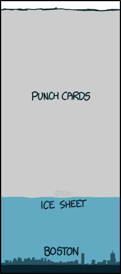

# Google 的打孔卡数据中心
###### 译自: what-if.xkcd.com
### Q? 如果所有数字数据都存储在打孔卡上，Google 的数据仓库会有多大？

——James Zetlen

***
### A?

Google 几乎肯定拥有地球上任何组织中最多的数据存储容量。

Google 对自己的运营非常保密，所以很难确定。只有少数组织在存储容量或服务器基础设施规模上可能超过它。我的候选短名单如下：NSA、NRO、NGIP、CIA、Schlumberger、Tencent、Chevron。

荣誉提名：Amazon（很大，但可能没有 Google 大）、Facebook（量级接近且增长很快，但仍在追赶）、Microsoft（他们有一百万台服务器，虽然似乎没人确定为什么）。

我们来仔细看看 Google 的计算平台。

**跟着钱走**

先从钱开始。Google 的累计资本支出，也就是用于建造东西的支出，加起来超过 120 亿美元。他们最大的几个数据中心每个耗资 5 亿到 10 亿美元，所以这类中心不可能超过 20 个左右。

Google 在官网承认，他们在南卡罗来纳州伯克利县、爱荷华州康瑟尔布拉夫斯、佐治亚州亚特兰大、俄克拉荷马州梅斯县、北卡罗来纳州勒努瓦、俄勒冈州达尔斯、香港、新加坡、台湾、芬兰哈米纳、比利时圣吉斯兰、爱尔兰都柏林和智利基利库拉都有数据中心。

此外，他们似乎还运营若干其他大型数据中心（有时通过子公司），包括荷兰 Eemshaven、荷兰 Groningen、匈牙利布达佩斯、波兰弗罗茨瓦夫、弗吉尼亚州雷斯顿，以及亚特兰大附近的其他地点。

他们还在全球数十到数百个较小地点运行设备。

**跟着电走**

为了弄清 Google 运行多少服务器，我们可以看他们的耗电量。不幸的是，我们不能偷偷溜到数据中心旁边读电表。等等，也许可以？应该有人试试。总之，我们只能挖资料。

Google 披露，2010 年他们平均消耗 258 兆瓦电力。他们的数据中心效率很高，只有 10% 到 20% 的电用于冷却和其他开销。为了估计每台服务器用多少电，我们可以看他们 2005 年的“集装箱数据中心”概念。它不清楚是否真的实际使用过，可能只是个现在过时的实验，但能说明他们当时认为合理的功耗：每台服务器 215 瓦。

按这个数字判断，2010 年他们运行约一百万台服务器。

此后他们增长了很多。到 2013 年底，他们投入数据中心的总资金会是 2010 年时的三到四倍。他们仅在三个地点就签约购买了超过 300 兆瓦电力，比 2010 年所有业务用电还多。

根据数据中心用电和支出估计，我猜 Google 目前正在运行，或很快会运行，180 万到 240 万台服务器。

但这些“服务器”实际代表什么？Google 可能在尝试各种狂野配置，比如每块板 100 个核心或 100 块附加硬盘。如果假设每台服务器挂着几块 2 TB 硬盘，我们会得到接近 10 EB 的活动存储，连接在运行中的集群上。

**10 EB**

商业硬盘行业每年出货约 8 EB 容量的硬盘。这些数字不一定包括 Google 这样的公司，但无论如何，Google 很可能占全球硬盘市场的一大块。

更糟的是，考虑到他们管理的硬盘数量巨大，Google 每隔几分钟就会坏一块硬盘。从全局看，这其实不是多昂贵的问题，他们只需要擅长更换硬盘。但想到 Google 员工运行一段代码时，他们知道等代码执行完，它运行所在的某台机器可能已经遭遇硬盘故障，还是很奇怪。

**Google 磁带存储**

当然，上面只包括运行中服务器连接的存储。“冷”存储呢？谁知道 Google 或其他任何人在地下档案库里存了多少数据？

2011 年，Tandberg Data 的 Simon Anderson 在接受 SMB Tech 的 Paul Mah 电话采访时透露，Google 是世界上最大的单一磁带盒消费者，每年购买 200,000 盒。假设他们扩张后采购量也增加，这可能又增加几 EB 的磁带档案。

**合在一起**

我们假设 Google 的存储容量为 15 EB，也就是 15,000,000,000,000,000,000 字节。

一张打孔卡能存约 80 个字符，一盒卡片装 2,000 张：

15 EB 的打孔卡足以把我的家乡新英格兰覆盖到约 4.5 千米深。这是上一次冰川推进时覆盖该地区冰盖厚度的三倍：

这听起来很多。

不过，和某些新闻报道对 NSA 犹他数据中心的荒唐说法相比，就不算什么了。

**NSA 数据中心**

NSA 正在犹他州建设一个数据中心。媒体报道声称它最多能存 1 YB 数据，这显然荒唐。

后来的报道改变说法，认为该设施只能存约 3 到 12 EB。我们还知道它耗电约 65 兆瓦，大约是一座大型 Google 数据中心的水平。

有些标题没有选择任一估计，而是宣布该设施能存“1 EB 到 1 YB 之间”的数据，这有点像说“目击者报告那条蛇长度在 1 毫米到 1 千米之间”。

**挖掘更多 Google 秘密**

有很多技巧可以挖掘 Google 运营信息。讽刺的是，很多技巧涉及使用 Google 本身，从搜索奇怪城市里的招聘信息，到用图片搜索找数据中心参观时泄露的手机照片。

不过，寻找秘密 Google 设施的最佳技巧，可能是前 Google 员工 talentlessclown 在 reddit 上透露的：

找到有人值守的 Google 数据中心，最简单的方法是问出租车司机和披萨外卖员。

这有种令人愉快的感觉。Google 创造了地球史上也许最复杂的信息收集装置，而唯一掌握关于他们信息的人，是披萨外卖司机。

谁监视监视者？

显然，是 Domino's。
