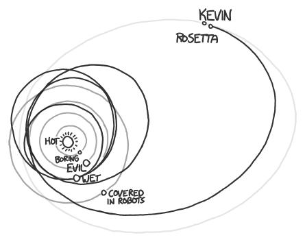

# 击中彗星
###### 译自: what-if.xkcd.com
### Q? 天体物理学家总说“这次彗星任务相当于从纽约扔一颗棒球，击中特定一扇旧金山窗户”。它们真的等价吗？

——Tom Foster

***
### A? 不。棒球那件事难多了。

要把东西从纽约扔到洛杉矶，你必须像洲际导弹一样把它抛出大气层。

不幸的是，棒球太小，无法穿过大气层。不管它速度多快，最后都会在到达太空前停下来。如果你想用棒球击中洛杉矶一扇窗户，更好的办法是把它扔向一架飞机，希望它在起飞时卡进起落架。

Tom 提到的那些天体物理学家所说的探访彗星飞船，大概是 Rosetta。它即将环绕 67P/Churyumov-Gerasimenko 彗星，并把着陆器送到彗星表面。

注意：67P/Churyumov-Gerasimenko 太拗口，所以本文余下部分我就把这颗彗星叫作“Kevin”。

Rosetta 目前即将抵达 Kevin，距离地球约 7.8 亿千米。它走了一条迂回路线：

Rosetta 的目标 Kevin 约 4 千米宽。它距离我们 7.8 亿千米。如果它和旧金山到纽约一样远，目标只有 2 厘米宽，比 Tom 引用的说法还令人印象深刻。

所以 Rosetta 击中目标，就像从纽约扔一个物体，让它击中旧金山某个键盘上的特定按键。

这不是公平比较，但你得承认，它听起来非常精确。我曾听过一个参与 Cassini-Huygens 任务的人讲述，其中一位设计者指出，他们的飞船前往十亿千米外的目标，并在距离预定时间大约一秒半内抵达。

另一方面，我们也可以做些不那么讨喜的比较。

比如远程手术。如果纽约的一名外科医生使用旧金山的远程手术机器人做眼科手术，而机器人以 Rosetta 接近目标的精度瞄准患者眼睛，它的激光会指向这里附近：

不过这也不是公平比较。Rosetta 和我们的激光外科医生都会在最后接近时不断修正动作，实现非常高的精度。

归根结底，远程手术和远程探测器着陆这两项任务，在距离意义上可能差不多精确。

这让我想到一件稍有不同的事，我想用它结束本文：给你一个问题试着回答。也就是：你更愿意押一百万美元赌航天器着陆工程师能成功做眼科手术，还是赌眼科医生能成功把探测器降落到彗星上？我一直没能决定。

