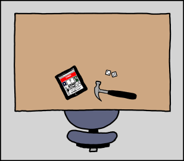

# 哈勃
###### 译自: what-if.xkcd.com
### Q? 如果哈勃望远镜对准地球，拍到的图像会有多清楚？

——Kyle Rankin

***
### A? 这是个常见问题。哈勃的操作人员经常被问到，他们的 FAQ 页面也回答过。

问题并不是有些人说的“地球太亮”。正如 Bad Astronomy 的 Phil Plait 指出的，哈勃其实经常看地球。

真正的问题是，哈勃在地表上方以每秒 7 千米以上的速度移动。即使曝光时间很短，图像也会糊成一片。

这就没意思了。有没有办法让它可行？我决定仔细看看。

作为拍摄目标，我们用这张普通书桌：

地球大气不会成为问题。事实上，对地面望远镜观测太空来说，大气问题要比太空望远镜观测地面严重得多。原因是几何上的：

哈勃是我们拥有的最好的可见光望远镜，但它的分辨率也有限。位于柯伊伯带的冥王星正好处在这个限制附近。我们拥有的冥王星最佳照片来自哈勃，但这颗前行星仍然不过是一团神秘的模糊影子。

在这个分辨率下（大约 0.05 角秒，上下浮动），加上哈勃到书桌的距离（约 570 千米），书桌看起来会像这样：

但这张书桌还在从视野中飞快掠过，所以即使完美成像也会被拖糊：

把两种效应合在一起，最终结果是这样：

这不行。

能不能转动哈勃来跟踪地表，消除运动模糊？

哈勃会转向跟随目标。通常这些目标足够远，可以假设它们在无限远处。机载自动视差算法无法处理比月球距离十倍还近的目标。天文学家想用它拍月球时，有时会发送命令让它手动旋转，然后在机动过程中打开相机。

效果不太好。以这种速度移动哈勃，对现有制导系统来说很笨重。得到的照片比肉眼看到的好，但以哈勃标准看并不怎么样。下面是我们的书桌，按那张月球照片类似程度降质后的样子：

幸运的是，月球足够明亮，如果你愿意接受短曝光，就能避免这个问题。这张照片用半秒曝光拍摄，短到不需要做太多跟踪。

不幸的是，我们的书桌穿过望远镜视场的速度大约是月球的 600 倍。跟踪不可避免。

奇怪的是，书桌本身其实没移动得那么快。只是哈勃真的很慢。为了跟踪地表，它最多只需要每秒旋转不到一度。

但哈勃不是为地表跟踪建造的。望远镜最高旋转（“转向”）速度只有每分钟几度（大约是钟表分针的速度），而即便是这种速度，它的陀螺仪也会让望远镜振动，破坏图像质量。

显然，我们需要禁用哈勃的制导系统，装上自己的控制系统。哈勃的转动惯量类似一座小旋转木马；对现有陀螺仪来说太难推动，但绝对意义上并不难。有了自定义控制系统，它可以跟踪地表，并拍出接近最佳质量的照片：

但这不只是一个假设情景。

人们认为，许多军用间谍卫星使用的技术与哈勃类似。因此，从某种意义上说，把哈勃类型的望远镜指向地表不仅可能，而且正是美国政府实际在做的事。
