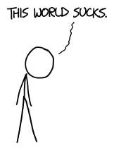
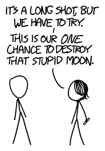

# 射向蓝天
###### Into the Blue
### Q．如果我在随机一点向天空发射一束无限强的激光，会造成多大破坏？

——Garrett D.

***
### A．很多时候，如果一个问题里包含“无限”这个词，答案就是“无限多”，如果它还能有答案的话。

一支无限强的激光笔会向路径上的空气输送无限多能量，而空气又会向各个方向辐射无限多能量，进而摧毁一切。更多内容见* [What If #13](index-15.htm)*。

只不过，这并不是你问题的真正答案。我们的大多数方程在你把“无限”放进去时，其实并不能正常工作。所以正确答案是：“无限强的激光束并不是真实存在的东西。”

但如果你把一支激光笔做得越来越强，结果会越来越像我刚才描述的那样。这有点像数学中的取极限；你不能说在无限*处*发生了什么，但你可以看到当你越来越接近它时，事情如何表现。

既然我们在第13问已经看过“毁灭世界”的后果，那么来看看你问题的另一部分：随机瞄准。

首先，如果你朝一个*真正*随机的方向瞄准，你有接近50%的概率会击中地球。

接近50%，但并不完全是。如果我们假设你站在一个球形地球上，忽略山丘和树木，也忽略折射，那么你错过地面的概率会比击中它稍高一点，因为你把激光举在地表之上，而地球会从你脚下弯走：

如果你没有击中地球，那么90000次里有89999次，你的光束会直接飞出银河系，不撞上任何东西。当它确实撞上什么时，几乎总是太阳或月球。

我第一次当面见到天文学家[Phil Plait](http://www.slate.com/blogs/bad_astronomy.html)时，他提到一个计算天空“面积”的聪明技巧。（“学会这个怪招，”他说，“由本地教师发明！”他没这么说。）

球体表面积是4πr2。好，很棒，但天空的“半径”是多少？如果天空是围绕我们的球体，那么半径就是“一弧度”，因为任何东西的半径都是这样。但一弧度也是57.3度，这意味着天空离我们“57.3度远”。4乘π乘57.3 = **41,253平方度**。

月球和太阳各自占据约0.2平方度，所以击中其中任意一个的概率约为十八万分之一。这个概率不算好，但已经比击中其他任何东西的概率高了。

要计算击中其他东西的概率，我们可以借用这个方便的[角尺寸](http://xkcd.com/1276/)参考图作为捷径，用图中某物体的大致角尺寸除以地球的总面积，看看它覆盖了天空的多少。比如，击中木星某颗卫星的概率约为一万亿分之一量级。

恒星更糟。即使你瞄准银河核心，在飞出银河系的路上击中任意一颗恒星的概率也几乎为零。

不过，这是好事！如果你击中恒星的概率很高，那就意味着银河系是不透明的。既然大多数“视线”都会终止于某颗恒星，我们就很难或不可能看见[银河系之外](https://en.wikipedia.org/wiki/Hubble_Ultra-Deep_Field)的东西。（哈勃超深场图像里只有少数几颗银河系内恒星。）夜空是黑的这一事实，是[奥伯斯佯谬](https://en.wikipedia.org/wiki/Olbers'_paradox)的核心。（我当时特别想去破坏这个条目，在每一句声称夜空是黑的后面都加上[需要引用]。）

如果你持续发射足够久，最终会击中一颗行星。海王星最难击中，其次是天王星和水星。冥王星会是最难的，但也许值得一试。一束不可能强的激光至少能解决*那个*争论。

