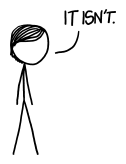
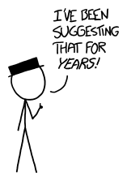

# 激光伞
###### Laser Umbrella
### Q．用伞或帐篷挡雨太无聊了。如果你试着用激光瞄准并汽化每一滴落下来的雨滴，让它们在接近地面十英尺之前消失，会怎样？

——Zach Wheeler

***
### A．用激光挡雨属于那种听起来完全合理的想法之一，但如果你——

虽然激光伞这个想法可能很吸引人，但它——

好吧。用激光挡雨，是我们现在正在讨论的事情。

这不是个很实用的想法。

首先，我们看看基本能量需求。汽化一升水需要大约 2.6 兆焦耳[^1]，而一场大暴雨每小时可能降下半英寸雨。这属于方程并不复杂的情况：你只要把每升 2.6 兆焦耳乘以降雨率，就能得到激光伞的功率需求（每平方米受保护面积的瓦数）。单位这么直截了当地相互抵消，总让人觉得有点怪：

$$
2.6\tfrac{\text{兆焦}}{\text{升}}\times0.5\tfrac{\text{英寸}}{\text{小时}}=9200\tfrac{\text{瓦}}{\text{平方米}}
$$

每平方米 9 千瓦，比阳光传递到地表的功率高一个数量级，所以你的周围环境会很快升温。实际上，你是在自己周围制造一团蒸汽云，然后不断往里面泵入越来越多的激光能量。

换句话说，你会建造一个人类大小的[高压灭菌器](https://en.wikipedia.org/wiki/Autoclave)。不用说，高压灭菌器并不是一个[受欢迎的居住地点](http://boston.craigslist.org/search/hhh?sort=rel&query=autoclave+you+can+live+in)。

但事情还会更糟！用激光汽化一滴水比听起来更复杂[^2]。关于这个主题有[很多](http://www.opticsinfobase.org/ao/abstract.cfm?uri=ao-24-11-1631)、[很多](http://pubs.rsc.org/en/Content/ArticleLanding/2003/CP/b210609d#!divAbstract)、[很多](http://authors.library.caltech.edu/10136/1/SAGao84.pdf)论文[^3]，总体意思是：要想在不只是把水滴炸成小水滴的情况下汽化它，需要大量能量，而且要快速送达。

[这里有个视频](https://www.youtube.com/watch?v=bRbHDtPbHe0)，展示一滴水被激光脉冲击中的过程；你可以看到，它更多是在把水滴炸散，而不是汽化。结论是，干净地汽化一滴水，所需能量很可能比我们已经认为[不合理](https://en.wikipedia.org/wiki/Autoclave)的量还要更多。

然后还有瞄准问题。理论上，这大概可以解决。[自适应光学](https://en.wikipedia.org/wiki/Adaptive_optics)可以极其快速、精确地控制光束。覆盖 100 平方米的区域（Zach 在完整来信中也问到了这个范围）需要大约每秒 50000 次脉冲。这个速度慢到不会遇到任何 *直接* 的相对论问题，但这台设备至少要比装在旋转底座上的激光笔复杂得多。

完全忘掉瞄准、只是朝随机方向发射激光，可能看起来更容易[^4]。如果你把一束激光朝随机方向射出，它要飞多远才会击中一滴雨？这个问题很容易回答；它等价于问你在雨中能看多远，而答案是至少[几百米](http://www.researchgate.net/publication/258316669_Review_of_the_mechanisms_of_visibility_reduction_by_rain_and_wet_road/links/00b7d527b4f9da256000000)。除非你想保护整个社区，否则朝随机方向发射强力激光大概帮不上忙。

而且，说实话，如果你 *真的* 想保护整个社区……

……朝随机方向发射强力激光 *绝对* 帮不上忙。

[^1]:如果水更冷，需要更多能量，但不会多 *太多*。把水加热到沸腾边缘只需要 2.6 兆焦耳中的一小部分。大部分能量都用于把它从 100°C 水推过门槛，变成 100°C 水蒸气。
[^2]:老实说，它听起来已经挺复杂了。
[^3]:J. C. Carls 和 J. R. Brock 的论文 [Explosion of a Water Droplet by Pulsed Laser Heating](http://dx.doi.org/10.1080/02786828708959148) 中有一句：“……在实践中，要在发生显著运动之前把液滴加热到极高温度……可能很困难。”  
同一篇论文里还有一些脱离上下文的句子：“液滴似乎保持了基本形状，并没有显得正在碎裂”，“先前形成的粒子可能会被汽化”，“状态方程表现古怪，说明一切并不正常”，“雪崩击穿”，“极低、有时为负的压力”，“可能达到的最动态响应”，以及“注意非常高的温度”。
[^4]:
