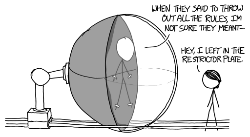

# 无规则 NASCAR
###### No-Rules NASCAR
### Q．如果取消赛车比赛的所有规则，只举办一场“尽可能快地让一个人绕赛道跑 200 圈”的比赛，什么策略会赢？假设赛车手必须活下来。

——Hunter Freyer

***
### A．你能做到的最好成绩大约是 90 分钟。

你可以用很多办法造你的载具，比如电动车[^1]、火箭雪橇，或者沿赛道轨道运行的车厢；但无论哪种方案，都很容易把设计推进到这样一个阶段：人类成了最薄弱的部分。

问题在于加速度。在赛道弯道部分，车手会感受到强大的 G 力[^2]。佛罗里达州的代托纳赛道有两个主要弯道，如果载具在弯道上开得太快，车手光是因为加速度就会死亡。

在极短时间内，比如车祸中，人可以承受数百个 G 并活下来。（1 个 G 是你站在地面上时感受到的地球重力拉力。）战斗机飞行员在机动时可以承受最高 10 个 G，也许正因如此，10 个 G 经常被用作人类可承受极限的粗略值。不过，战斗机飞行员只会非常短暂地承受 10 个 G。我们的车手会以脉冲形式承受这些力，持续数分钟，甚至很可能持续数小时。

NASA 有一份关于加速度生理效应的优秀文档，[在这里](http://ntrs.nasa.gov/archive/nasa/casi.ntrs.nasa.gov/19930020462.pdf)；[这里](http://history.nasa.gov/conghand/mannedev.htm)的图 5 也特别有用。

但最有趣的数据来自 John Paul Stapp。Stapp 是一名空军军官，他把自己绑进火箭雪橇，把身体推向极限，并在每次测试后认真记录。你可以在 [the Ejection Site](http://www.ejectionsite.com/) 上读到一篇关于他的[精彩文章](http://www.ejectionsite.com/stapp.htm)。整个故事都很迷人，但我最喜欢的一句是：“……Stapp 晋升为少校，并被提醒人类生存极限是 18 个 G……”

先把 Stapp 放一边，数据显示，对于约一小时量级的持续时间，普通人只能承受 3 到 6 个 G 的加速度。如果我们把载具限制在 4 个 G，它在代托纳弯道上的最高速度约为 240 英里/小时。按这个速度，跑完整条赛道需要大约 2 小时，确实比任何人在真实汽车里开出的成绩都快，但也没快太多。

等等！那直道怎么办？载具在弯道上会加速，但在直道上会滑行。我们可以改成在直线路段把载具加速到更高速度，然后接近终点时再减速回来。这样会得到类似下面的速度曲线：

这还有一个额外好处：通过在赛道上做一些聪明的来回机动，可以让车手在整个旅程中承受相对恒定的加速度，希望这样能让这些力更容易忍受。

请记住，加速度方向会一直改变。如果人被向前、也就是朝胸口方向加速，比如驾驶员向前加速时那样，人类最能承受这种加速度。人体最不擅长承受向脚方向的加速度，因为这会让血液堆到头部。为了让车手活下来，我们需要旋转座椅，让他们始终被压在后背上。（但我们必须小心，不能改变方向太快，否则座椅旋转产生的离心/向心折中力[^3]本身就会变得致命！）

最快的现代代托纳赛车手完成 200 圈大约需要 3 小时。如果限制在 4 个 G，我们的车手会在不到 1 小时 45 分钟内完赛。如果把限制提高到 6 个 G，时间会降到 1 小时 20 分钟。到了 10 个 G，也就是远超人类耐受范围，仍然需要 1 小时。（而且还会在后直道突破音障。）

所以，除非采用[液体呼吸](http://en.wikipedia.org/wiki/Liquid_breathing)这类可疑概念，人类生理会把我们限制在一小时以上的代托纳完赛时间。那么如果去掉“活下来”的要求呢？我们能让载具以多快绕赛道跑？

想象一个“载具”，用凯夫拉带固定到赛道中心的支点上，另一侧再用配重加固。实际上，这就是一台巨大离心机。这让我们可以应用我最喜欢的奇怪方程之一[^4]：旋转圆盘边缘的速度不能超过构成材料的比强度[^5]平方根。对凯夫拉这类高强材料来说，这个速度是 1 到 2 千米/秒。在这些速度下，一个舱体理论上可以在大约 10 分钟内完成比赛，虽然里面肯定不会有活着的车手。

好吧，忘掉离心机。如果我们造一条像雪车赛道一样的坚固滑槽，把一个球轴承（我们的“载具”）沿着它高速送下去呢？遗憾的是，圆盘方程再次出击：球轴承不能滚得超过几千米/秒，否则它会转得太快，把自己撕碎。

不让它滚，让它滑行怎么样？我们可以想象一个钻石立方体沿着光滑的钻石滑槽滑动。由于它不需要旋转，理论上它可以承受比滚动球轴承更大的加速度。不过，滑动会产生比球轴承方案多得多的摩擦，而我们的钻石可能会[着火](https://www.youtube.com/watch?v=WWpm6_Y7ASI)。

为了战胜摩擦，我们可以用磁场把舱体悬浮起来，并让它逐渐变得更小、更轻，以便更容易加速和转向。糟了，我们不小心造出了一台粒子加速器。

虽然它并不完全符合 Hunter 问题中的条件，但粒子加速器是个很好的对照。LHC 束流中的粒子速度非常接近光速。在这个速度下，它们跑完 500 英里（30 圈）只需要 2.7 毫秒。

Wikipedia [列出](http://en.wikipedia.org/wiki/List_of_motor_racing_tracks)了大约 850 条赛车场。LHC 束流可以在车手到达第一个弯道前，在大约 2 秒内依次在这 850 条赛道上各跑完相当于一场完整 Daytona 500 的距离。

这就 *真的* 是你能达到的最快速度了。

[^1]:轮子设计成能在转弯时咬进路面。
[^2]:你可以笼统地称它们为“离心”或“向心”力，具体取决于你想惹恼哪一类较真的人。
[^3]:各退一步。
[^4]:参见第 86 篇文章脚注 [8]。
[^5]:抗拉强度除以密度。
