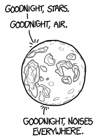

# 一秒一天
###### One-Second Day
### Q．如果地球自转加速到一天只持续一秒，会发生什么？

——Dylan

***
### A．如果这件事要发生，我希望它别发生在下周五傍晚。

地球在自转，[<em>[需要引用](http://www.timecube.com/)</em>] 这意味着它的中段正被离心力向外甩[^1]。这个离心力还没有强到能克服重力、把地球撕碎，但已经足以让地球略微变扁，并让你在赤道上的体重比在两极轻将近一磅[^2]。

如果地球（以及地球上的一切）突然加速到一天只有一秒，地球甚至撑不过完整的一天[^3]。赤道会以超过光速 10% 的速度运动。离心力会变得远强于重力，组成地球的物质会被向外甩飞。

你不会瞬间死亡，可能还能活几毫秒，甚至几秒钟。这听起来不算多，但和其他涉及相对论速度的 [What If 文章](../Relativistic_Baseball)里你的死亡速度相比，已经相当长了。

地壳和地幔会碎成建筑物大小的块。等一秒钟[^4]过去，大气会扩散到稀薄得无法呼吸，虽然即使在相对静止的两极，你大概也活不到窒息那一刻。

在最初几秒里，膨胀会把地壳撕成旋转碎片，并杀死地球上几乎所有人；但和接下来要发生的事相比，这已经算相对平和了。

一切都会以相对论速度运动，但每一块地壳碎片与邻近碎片的速度都差不多。这意味着情况会相对平静……直到这个圆盘撞上什么东西。

第一个障碍物会是环绕地球的卫星带。40 毫秒后，国际空间站会被膨胀大气的边缘击中，并瞬间汽化。更多卫星会紧随其后。一秒半之后，这个圆盘会抵达赤道上方的地球同步卫星带。每一颗卫星被地球吞下时，都会释放出一阵猛烈的伽马射线。

地球碎片会像一把不断扩张的圆锯一样向外切开。这个圆盘大约 10 秒后经过月球，再过一个小时扩散到太阳之外，一两天内就会横跨太阳系。每当圆盘吞没一颗小行星，它都会向各个方向喷出一股能量洪流，最终把太阳系中每一个表面都消毒一遍。

由于地球有倾角，太阳和行星通常并不排在地球赤道平面上。它们有很大机会避开这把圆锯[^5]的直接切割。

不过，下周五，也就是 4 月 25 日，月球会穿过地球赤道平面（它每两周都会这么做）。如果 Dylan 在这一刻加速地球，月球就会正好位于这把行星圆锯的路径上。

这次撞击会把月球变成一颗彗星，让它裹着碎片喷流冲出太阳系。闪光和热量会如此明亮，以至于如果你站在太阳表面，你头顶会比脚下更亮。太阳系中的每一个表面，欧罗巴的冰、土星环、水星的岩质地壳，都会被冲刷干净……

……被月光冲刷。

[^1]:它仍然是个[真实存在的东西](http://xkcd.com/123/)。
[^2]:这是由好几个效应造成的，包括离心力、地球被压扁的形状，以及如果你在北美往极地方向走得足够远，人们会开始给你提供肉汁奶酪薯条。
[^3]:不管哪种“一天”。
[^4]:我是说，一天。
[^5]:我老是把这个词看成 BuzzFeed。
