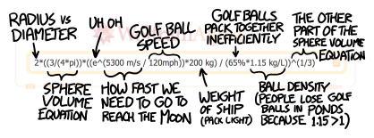
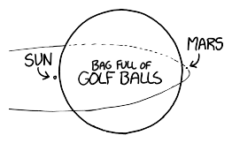

# 高尔夫球火箭推进器
###### Rocket Golf
### Q．假设我有一艘绕地球运行的飞船，我能不能通过朝相反方向击打高尔夫球，把飞船推进到超过逃逸速度？如果可以，要打多少个高尔夫球才能到达月球？

——丹（加拿大安大略省卡纳塔）

***
### A．这取决于你的挥杆水平。

这听起来像是在敷衍，但某种意义上确实如此。这个问题的答案取决于你究竟能把高尔夫球打到多快。

有时候，精确数字没那么重要。如果我的棒球、汽车、狗或者赞博尼磨冰车比你的稍微快一点[^1]，它就会跑得稍微远一点。但火箭高尔夫不是这么回事。我们这艘飞船的设计会用到一个方程，而高尔夫球的速度出现在指数里。这意味着速度只要有一点小变化，结果就可能差很多。

这个方程就是齐奥尔科夫斯基火箭方程，它也许是我最喜欢的物理方程：

$$
\Delta v = v_\text{exhaust} \ln \frac{m_\text{initial}}{m_\text{final}}
$$

这个方程在《What If》的计算里经常出现。我喜欢它，一方面是因为它揭示了人类探索宇宙能力中的某种基本限制，另一方面是因为你可以靠它把《坎巴拉太空计划》玩得特别好。

把这个方程稍微变形一下，就能帮我们算出飞船重量中必须有多少比例是高尔夫球：

$$
\frac{\text{飞船加高尔夫球的质量}}{\text{只有飞船的质量}} = e ^ \left ( \frac{\text{飞船速度变化量}}{\text{高尔夫球速度}} \right )
$$

像我这样从来没打过高尔夫的人，在挥空几次之后，也许能把球打到 120 英里/小时（50 米/秒）[^2]。要从近地轨道飞到月球，你需要给飞船增加 5300 米/秒的速度。把这些数字代入火箭方程，我们就能知道，普通高尔夫球手要到达月球，需要多大一袋高尔夫球。如果我们把它[交给 Wolfram|Alpha 算一下](http://www.wolframalpha.com/input/?i=please+calculate+2*%28%283%2F%284*pi%29%29*%28%28e%5E%285300+m%2Fs+%2F+120mph%29%29*200+kg%29+%2F+%2865%25*1.15+kg%2FL%29%29%5E%281%2F3%29+thank+you)……

……就会发现，这袋高尔夫球的直径差不多正好是 1000 亿英里。这比我们的太阳系大得多得多[^3]。

它还会立刻猛烈坍缩成一个黑洞。

幸运的是，只要对方程里的“120”做一点相对不大的改动，我们应该就能避免这场灾难。如果把高尔夫球速度从 120 英里/小时提高到 150 英里/小时，答案会急剧缩小，所需的高尔夫球数量可以紧紧塞进太阳和火星之间。虽然还是大到避免不了灾难性坍缩，但至少有进展了。

泰格·伍兹能把高尔夫球打到大约 180 英里/小时，这意味着如果由他给我们的飞船提供动力，高尔夫球袋的直径只会是太阳的两倍！

据《吉尼斯世界纪录》[记载](http://www.guinnessworldrecords.com/records-10000/fastest-golf-drive/)，最快开球纪录是 211 英里/小时，由莫里斯·艾伦在 2012 年创下。这对应的高尔夫球袋直径只有 10 万千米，比木星还小，但（显然）还是不实用。

不过，高尔夫球手 Ryan Winther [声称](http://www.ryanwinther.com/about_records.htm)自己打破过这个纪录，只是当时没有吉尼斯观察员在场[^4]。他的球速由一个叫“Titleist Performance Institute”的机构测得为 226.7 英里/小时，他还声称自己的个人最好成绩是 237 英里/小时。如果他能稳定打出 237 英里/小时，我们就可以把燃料容器缩小到地球大小[^5]。

这仍然行不通；即使在高轨道上，你的飞船引起的巨大潮汐也会造成严重破坏，因为它的质量远远超过月球。

我们也许可以通过使用“非法”装备来进一步缩小燃料箱。有一些类似弹力球的球，以及“蹦床杆面”的球杆，可以把球打得远得多，而且在比赛中不允许使用[^6]。如果假设开球速度能达到 270 英里/小时，燃料箱就能缩小到月球大小。

到这一步，我们为什么还要用球杆呢？

根据美国空军学院和 BTG Research 的[研究](http://arxiv.org/abs/1305.0966)[^7]，用乙炔作燃料的土豆炮可以把土豆发射到 140 米/秒（310 英里/小时）。如果它也能以这个速度发射高尔夫球[^8]，我们的飞船直径就只有 150 英里了！

还有个小问题：制造这么多高尔夫球要花掉数百京美元。你可以继续把土豆炮做得越来越强、越来越高效，让尺寸进一步降低，但到了那一步，你其实就是在造火箭了。

土豆炮方案还有一个额外好处。如果你能用某种办法让这些球结实到足以扛过再入大气层，并且安排好机动，让被抛出的高尔夫球均匀覆盖中纬度地区，那么在整个机动过程中，从统计上说，你很可能会在世界上每一个高尔夫球场都打出一杆进洞。

[^1]:赌 20 美元，它们会的！
[^2]:参见 Trackman 关于[球速](http://mytrackman.com/explore/trackman-data/trackman-ball-data/ball-speed)的页面。
[^3]:作为费米估算的经验法则，内太阳系行星相隔大约 1 亿千米，外太阳系行星相隔大约 10 亿千米。或者英里也行，反正数量级差不多。
[^4]:显然，除非有啤酒公司的人监督，否则不算数。如果你想创造世界纪录，就把高尔夫球打向测速雷达，然后让 Mike's Hard Lemonade 的人来认证。
[^5]:不过它仍然大到会在自身引力下部分坍缩，类似之前那篇[一摩尔鼹鼠](../A_Mole_Of_Moles)里的情况。
[^6]:另一方面，我们说的是一项把只准白人入会的俱乐部[带进了 21 世纪](http://www.washingtonpost.com/wp-dyn/content/article/2010/06/01/AR2010060103918.html)的运动，而且举办大师赛的奥古斯塔直到 [2012 年](http://www.reuters.com/article/2012/08/20/us-golf-augusta-idUSBRE87J0IE20120820)才接纳第一位女性会员。所以也许我们没必要太担心它的传统规则。
[^7]:奇怪的是，两位研究者的名字都叫 Courtney。美国大概有 20 万个名或姓叫 Courtney 的人；也许我们应该把他们全都招来造土豆炮。
[^8]:我们没有把乙炔的重量算进去；不过话说回来，我们之前也没把高尔夫球手为了持续开球而需要吃掉的汉堡重量算进去。
