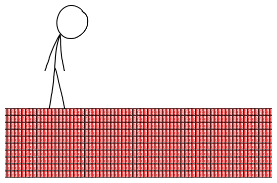

# 汽水碳封存
###### Soda Sequestration
### Q．全世界瓶装碳酸饮料的库存中含有多少 CO2？需要多少汽水才能把大气中的 CO2 拉回工业化前水平？

——Brandon Seah

***
### A．在人类文明史的大部分时间里，大气中的二氧化碳浓度大约是百万分之 270。过去一百年里，工业活动把这个数字[推高](http://www.skepticalscience.com/print.php?r=45)到了百万分之 400。

大气中每“百万分之一”的 CO2 约重 78 亿吨。一听汽水里大约含有 2.2 克 CO2，所以你需要大约 45 亿亿罐汽水。这足够在地球所有陆地上铺十层易拉罐。

显然，地球上没有足够空间这么做。就算我们把易拉罐一直堆到太空边缘[^1]，它们仍然会占据一个罗得岛州大小的面积[^2]。

我们还得加入更多易拉罐，才能追上持续排放。我们目前正以平均每年百万分之 2 的速度提高大气 CO2 浓度：

照这个速度，我们需要每 30 秒给每个人增加一罐汽水，约为当前消费速度的 10000 倍[^3]。这大概每 6 年[^4]就会给地面新增一层易拉罐。

这层易拉罐会变得相当烦人。

有什么办法能摆脱这个困境吗？

在一些地区，你可以把汽水罐拿去回收并换到一点钱；在我住的马萨诸塞州，每罐是 5 美分。如果你收集一年份的汽水罐，而不是把它们铺满地球表面，再把它们倒空，你可以换回 372 万亿美元。

有了这么多钱，你可以直接买下全世界现有的煤、石油和天然气储量[^5]，也就是整个问题的源头。

然后，把它们全都埋回地下，放在那里别动。

问题解决。

[^1]:我没有硬数据，但我猜超市里那种六听装汽水箱大概能堆到几百米高，然后最底层就会破裂。
[^2]:考虑到[上一次](../Everybody_Jump)发生的事，我们不该真的尝试。
[^3]:全球[平均](./Soda_Planet)是每人每 5 天一罐。在美国，平均是每 18 小时一罐。
[^4]:我原来在这里写错了数字；感谢 Paulina 抓到这个错误！
[^5]:来源：[xkcd.com/980](http://xkcd.com/980)，右下角。
