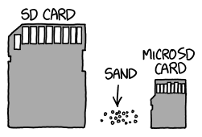
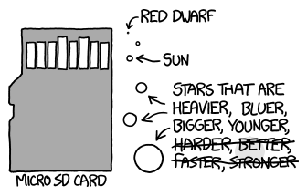
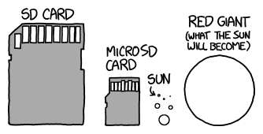

# 星砂
###### 译自: what-if.xkcd.com
### Q? 如果用和银河系恒星成比例大小的沙粒做一片海滩，那片海滩会是什么样？

——Jeff Wartes

***
### A? 沙子很有趣。[需要引用]

“沙粒多，还是天上的星星多？”是个热门问题，很多人都研究过。结论是，可见宇宙中的恒星数量大概多于地球所有海滩上的沙粒。

人们做这些计算时，常会挖出一些不错的恒星数量数据，然后对沙粒大小挥挥手，估出地球上的沙粒数。从实用角度看，地质学和土壤科学比天体物理学复杂。我们今天不处理这个问题，但要回答 Jeff 的问题，确实需要搞清楚沙子到底是什么。具体来说，我们需要知道黏土、粉砂、细沙、粗沙和砾石分别对应什么粒径，这样才能理解如果银河系是一片海滩，它看起来和摸起来会怎样。

幸运的是，美国地质调查局有一张很棒的图表回答了所有这些问题以及更多问题。不知为什么，我觉得这张图特别令人满足，就像侵蚀地质学版本的电磁波谱图。

根据对沙子的调查，海滩上的颗粒通常从 0.2 mm 到 0.5 mm（最细的层在上面）。这对应图表中的中砂到粗砂。单个颗粒大概这么大：

如果假设太阳对应一颗典型沙粒，再乘以银河系恒星数量，我们会得到一大盒沙坑的沙子。

但这是错的。原因是：恒星并不都一样大。

网上有许多广泛传播的 YouTube 视频比较恒星大小。它们很好地传达了某些恒星有多么惊人地巨大。虽然很容易在视频中迷失并失去尺度感，但很明显，我们沙坑宇宙中的一些颗粒更像巨石。

下面是主序星沙粒的样子：

它们大多属于“沙子”类别，不过较大的 Daft Punk 星会越过界线，成为“颗粒”或“小鹅卵石”。

然而，那只是主序星。垂死恒星会变得大得多。

当恒星耗尽燃料，它会膨胀成红巨星。普通恒星也能产生巨大的红巨星，但当一颗本来就很大的恒星进入这个阶段，它会变成真正的怪物。这些红超巨星是宇宙中最大的恒星。

这些沙滩球大小的沙星会很少见，但葡萄大小和棒球大小的红巨星相对常见。虽然它们远不如类太阳恒星或红矮星丰富，但巨大体积意味着它们会构成我们这堆沙的大部分体积。我们会有一大沙坑的颗粒……外加一片延伸数英里的砾石场。

小沙堆会包含整堆中 99% 的单个颗粒，但不到总体积的 1%。我们的太阳不是柔软银河海滩上的一粒沙；相反，银河系是一片巨石场，中间夹杂着一点沙子。

不过，就像真实地球海岸一样，岩石之间那些少见的小片沙地，似乎才是所有乐趣发生的地方。

