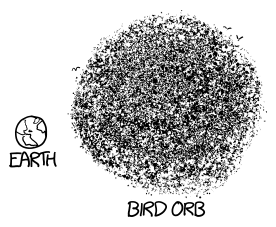

# 椋鸟
###### Starlings
### Q．我在看[这个视频](http://www.youtube.com/watch?v=eakKfY5aHmY)，然后想到：需要多少只鸟，重力才会接管，把它们压成一个巨大的鸟球？

——贾斯廷·贝辛格

***
### A．视频里展示的是椋鸟，这种鸟……

* 有时会聚集成超过一百万只的巨大鸟群
* 会[说话](https://www.youtube.com/watch?v=1VZYG00_qvE)
* 听起来像R2-D2，不过没有[长刺歌雀](https://www.youtube.com/watch?v=9ABjBldAtPQ#t=9)那么像

相邻椋鸟之间的引力很小。如果两只鸟相隔半米飞行，并试图完全笔直地向前飞，它们得飞上一千多公里，彼此之间的引力才终于会把它们拽到撞在一起。

顺便一提：下面这句话是一篇关于椋鸟代谢的[期刊论文](http://jeb.biologists.org/content/204/19/3311)的第一句：

> 我们训练了两只椋鸟（Sturnus vulgaris），让它们戴着呼吸测量面罩在风洞中飞行。

我真的觉得这篇论文到这里就该停下；不管他们得出了什么结果，都不可能超越开头这项成就。

总之，回到重力。

要计算整群椋鸟产生的引力，我们需要知道鸟群的密度。

很方便的是，2008年发表在*Animal Behavior*上的[一篇论文](http://arxiv.org/abs/0802.1667)收集了一些关于椋鸟群的详细统计数据。他们观察到的最高密度约为每立方米半只椋鸟。（0.54只/米3。）如果每只鸟重约85克，这意味着椋鸟群中的空气重量是椋鸟本身的25倍。（这在直觉上也说得通。如果它们比自己周围的空气重那么多，很难想象它们怎么还能靠翅膀拍打空气停留在空中。）

这意味着空气的引力是椋鸟云引力的25倍，而主导坍缩的会是空气的引力。

巨大气体云，或者巨大鸟云的坍缩，由[金斯不稳定性](http://en.wikipedia.org/wiki/Jeans_instability)方程支配。它表明，一团均匀的、室温的、充满椋鸟的空气云，要想发生坍缩，尺寸必须远大于地球。

这团气体云的引力会非常弱，所以在适应之前，椋鸟们大概会很难飞行。（鸟类[可以在零重力中飞](https://www.youtube.com/watch?v=w4sZ3qe6PiI&feature=kp)，或者至少说，它们会困惑地扑腾。不过，说句公道话，如果我突然毫无预警地被人从床上拽起来，丢进零重力飞机舱里的空中，我也会那么反应。）

如果没有额外的压缩，这样的云一开始根本不会形成。要让椋鸟云在自身重力下自然坍缩，它必须大到足以吞没整个太阳系。当它真的坍缩时，它会升温，而那些椋鸟……

……会变成一颗恒星。
