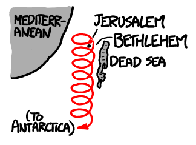
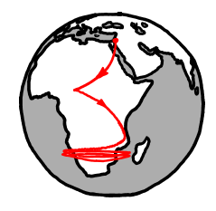
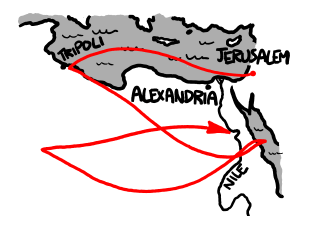
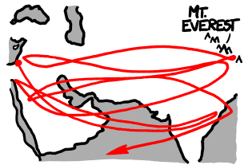

# 三贤士
###### 译自: what-if.xkcd.com
### Q? 三贤士的故事让我想到：如果你真的以固定速度朝一颗星星走去，会在地球上画出什么路径？它会收敛到一个固定循环吗？

——N. Murdoch

***
### A? 如果贤士们从耶路撒冷出发，日夜不停地朝天狼星走去，即使它在地平线以下也照走，他们在地表上的路径会是这样：

如果我们允许一点神学混乱，假设贤士们可以在水上行走，他们最终会在南极周围形成一个直径 30 千米的无尽圆圈。

不过我们现实一点：贤士们应该不会在星星躲到地球背后时还朝它走。我们假设他们只在星星出现在天空中且太阳已经落山时才朝它走。

在这种情况下，他们的路径真的会经过伯利恒：

如果他们没有在那里停下，几年后，他们会绕着博茨瓦纳转圈：

这些路径的计算使用了 PyEphem 等工具，它能帮助确定天体在历史上的位置。

要搞清贤士们究竟在追随什么，并不容易。伯利恒之星没有多少好的天文候选（中国记录中没有合适时间的超新星，其他明显候选也对不上），而且关于耶稣的出生日期，也存在大量历史和神学争议（“公元前 4 年”似乎最接近历史共识）。这些图都用一个相当任意的出发日期计算：公元 1 年 12 月 25 日，从耶路撒冷出发。不同出发日期会导致不同路径，但整体图景类似。

如果贤士们跟随一颗行星呢？

行星会在恒星背景上移动，因此产生的路径更复杂。下面是贤士们如果跟随金星会走出的路线：

这是他们跟随火星的路径：

如果三贤士有一辆能以公路速度在陆地和水面上行驶的悬浮车（某部诺斯替福音里肯定有），并决定跟随金星，他们会走出一条特别奇怪的路径：

有一次，他们会在 10 月抵达北极附近。在那里，太阳和金星会花几个月时间贴近地平线升起又落下，把东方贤士推入围绕北极长达一个月的螺旋，也就是一个北极附近的混沌奇异贤士吸引子；有人认为它为圣诞老人故事提供了神学基础 [需要引用]。

可惜，三贤士大概并不是在跟随金星。它是夜空中最熟悉的天体之一。已故的 Patrick Moore 爵士曾说，如果贤士们把它误认为一颗新星，那他们可算不上多贤明。

但也许他们比 Patrick 爵士认为的更聪明。毕竟，如果你随机挑一颗天上的星星，指向地平线，然后预言那个方向马上会有一个婴儿出生，统计学和出生率都会站在你这边。
