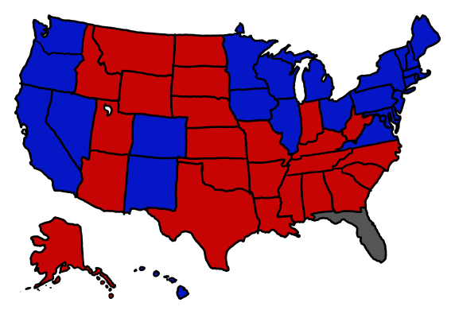
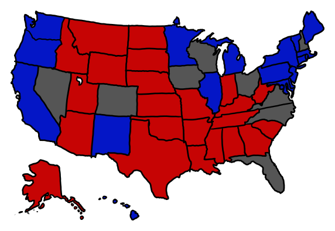

# 平票
###### 译自: what-if.xkcd.com
### Q? 如果真的出现了字面意义上的平票，会怎样？

——Nate Silver（Twitter，2012 年 1 月 4 日）

***
### A? 在大多数州，普选票数相同会通过抛硬币或从帽子里抽名字来打破平局。多个州同时平票的概率，比那顶帽子被走私毒品的飞机上扔下来的一包可卡因砸中的概率还要低。

Nate Silver 在 2012 年共和党艾奥瓦州党团会议计票期间，随口在 Twitter 上提出了这个“平票”问题。当时结果极其接近，但最终没有真的平票：Santorum 在 121,503 张选票中以 34 票优势胜出。而且由于那次投票只是没有约束力的提名投票，即使出现平票，艾奥瓦州共和党也可以随他们喜欢的方式处理。

不过既然今天是选举日，我们就把他的问题套到眼前这场选举上。如果出现平票，究竟会发生什么？

我说的不是选举人团平票。今年那种情况的概率大概是 1/500，后果也已经被[详细探讨过](http://blog.constitutioncenter.org/2012/11/an-electoral-college-tie-explained/)。这里的问题是：在某个州，两位候选人得到的票数完全相同。

包括 [Silver 本人](http://www.stat.columbia.edu/~gelman/research/published/probdecisive2.pdf)在内的几位研究者，都计算过某个州的胜负由一票决定的概率。这基本等同于出现平票的概率。对典型的摇摆州来说，链接那篇文章算出的概率大约在十万分之一量级。这也符合直觉，因为摇摆州选举通常就是以十万票左右的差距决出胜负。

那么，如果今年某个竞争激烈的州平票了呢？

进一步说，如果每个战场州都平票了呢？

首先，会重新计票。但由于接近的选举本来就会重新计票，重计票既可能制造平票，也可能打破平票。它不会改变底层概率。所以我们假设所有重新计票结束后，结果仍然是平票。接下来怎么办？

简短答案是：看各州法律。

我查阅了九个竞争州的通用法律，看看它们如何处理普选平票。在大多数州，平票会通过“抽签”解决，也就是随机决定。（如果你好奇，这里有各州部分平票法律的链接：[弗吉尼亚](http://leg1.state.va.us/cgi-bin/legp504.exe?000+cod+24.2-674)、[北卡罗来纳](http://law.onecle.com/north-carolina/163-elections-and-election-laws/163-182.8.html)、[佛罗里达](http://election.dos.state.fl.us/publications/pdf/2012/2012_Election_Laws.pdf)、[俄亥俄](http://codes.ohio.gov/orc/3505.33)、[新罕布什尔](http://www.gencourt.state.nh.us/rsa/html/lxiii/667/667-17.htm)、[威斯康星](http://docs.legis.wi.gov/statutes/statutes/5/I/01)、[科罗拉多](http://www.state.co.us/gov_dir/leg_dir/olls/sl1999/sl_154.htm)、[艾奥瓦](http://search.legis.state.ia.us/nxt/gateway.dll/ic/1/13/2174/2175/2582/2629?f=templates$fn=document-frameset.htm$q=[field%2050.44]$x=Advanced)、[内华达](http://www.leg.state.nv.us/NRS/NRS-293.html#NRS293Sec400)。）

“抽签”可以指抛硬币、抽签条，或从帽子里抽名字。大多数州把具体细节交给州务卿或选举委员会决定，不过《艾奥瓦州法典》50.44 条规定，名字要写在纸片上，放进一个“容器”里。不过在北卡罗来纳，如果平票时已投票数超过 5,000，就要重新选举。（而重新选举本身也可能再次平票……）

但我们来设想，不只是一个州平票，而是九个最激烈的州都平票了（其余各州则按预期结果归属）。如果北卡罗来纳举行第二轮选举来打破平局，其他八个州抛硬币（或从艾奥瓦州的容器里抽签），那么奥巴马会在 [512 种情况中的 431 种](http://www.nytimes.com/interactive/2012/11/02/us/politics/paths-to-the-white-house.html)里连任，也就是大约 84% 的时间。

但九个州同时平票有多可能呢？

如果我们粗略估计，每个接近州出现平票的概率是十万分之一，那么九个州全都平票的概率大约是一千万亿亿亿亿分之一，也就是 1 后面跟 45 个零。（这忽略了各州投票之间的相关性，不过作为一阶估算已经够用了。）

佛罗里达平均每年会遭遇 [66 场龙卷风](http://www1.ncdc.noaa.gov/pub/data/cmb/images/tornado/clim/ann-avg-torn1991-2010.gif)。如果每场龙卷风宽 50 码，路径长 1.5 英里（这属于[典型值](http://www.crh.noaa.gov/lmk/soo/docu/tornado_faq.php)，虽然不一定是平均值），我们就可以算出，佛罗里达某个典型地点平均每秒会经历 1.4 皮龙卷风：

$$
66\tfrac{\text{场龙卷风}}{\text{年}}\times\frac{1.5\text{ 英里}\times50\text{ 码}}{\text{佛罗里达面积}}\approx1.4\times10^{-12}\tfrac{\text{场龙卷风}}{\text{秒}}
$$

天文学家 Alan Harris 计算过，一个人一生中死于彗星或陨石撞击的概率大约是七十万分之一。如果计算中的典型人寿命为 70 年，这意味着一位佛罗里达居民平均每秒会承受 0.64 飞死亡的陨石撞击风险：

$$
\frac{\tfrac{1}{700,000}\text{死亡}}{70\text{ 年}}\approx6.4\times10^{-16}\tfrac{\text{死亡}}{\text{秒}}
$$

1994 年，逃避执法人员追捕的毒品走私者从飞机上向佛罗里达上空扔下了估计 20 包可卡因，其中一包[砸穿了一场“社区防罪观察”会议的屋顶，差点砸中 Homestead 的警察局长](http://www.deseretnews.com/article/392575/ONLY-IN-FLORIDA-DOES-COCAINE-DROP-FROM-SKY.html?pg=all)。如果过去 20 年里佛罗里达被 20 包可卡因砸中过，那么佛罗里达的普通人平均每秒会被 29 仄普托包可卡因击中：

$$
\frac{20\text{ 包}}{20\text{ 年}}\times\frac{\left(\tfrac{75\text{ kg}}{\text{可卡因密度}}  \right)^\tfrac{2}{3}}{\text{佛罗里达面积}}\approx2.9\times10^{-21}\tfrac{\text{包}}{\text{秒}}
$$

 
（顺便说一句，这意味着按每千克 20,000 美元的街头价格计算，佛罗里达每英亩土地从天降可卡因包中获得的平均收入是每年三美分。）

把这些合在一起：所有战场州全部精确平票的概率，大致等同于这样一件事发生的概率：当佛罗里达的一名选举人把手伸进帽子里抽名字时，他或她被一包从天而降的可卡因砸中；接下来几秒内，那顶帽子又被龙卷风卷走；几分钟后，这名选举人被陨石撞击彻底抹掉。

如果你在美国，别忘了投票——你的一票可能会制造或打破平局。

如果你在佛罗里达投票，记得多看看天上。
