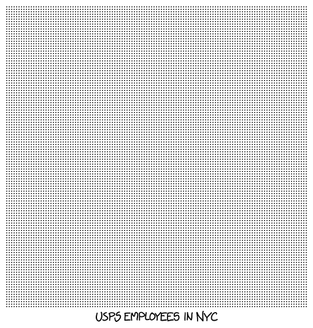

# 走遍纽约
###### Walking New York
### Q．一个人能在一生中走完整个纽约市吗？（包括公寓内部）

——阿萨夫·沙米尔

***
### A．就像[给地球刷漆](index-86.htm)那个答案一样，这个问题第一部分的答案相当容易查到。

但如果它*不容易查*呢？我们能不能根据已经知道的东西推算出答案？让我们看看几种估算方法。

首先，街道有多宽？我从没见过闪烁的人行横道倒计时标志从少于10秒开始；如果人们每秒走1米，那么大多数道路大概至少有10米宽。（1892年的《世界年鉴》里有一张表，列出了曼哈顿所有大道和街道的宽度，以及所有街区的长度，证实即使在1892年，街道也至少有20米宽。我在博客[Stuff Nobody Cares About](http://stuffnobodycaresabout.com/2012/11/19/all-new-york-city-streets-are-not-created-equal/)上找到了一份表格副本。）

大多数人一天走10公里（6英里）不会有什么问题。如果这座城市被一公里长的街道铺满，街道一条挨一条，中间没有空隙，那么10公里里可以并排放下1000条路。这意味着一个人最多用3年，就能在整个10公里乘10公里的网格中来回走遍。（这是街道。你还得为大道再加3年。）

我不知道需要多少块10公里见方的区域才能覆盖纽约市，但大概不会很多。（事实证明，如果把陆地和水域都算上，略多于1块。）而且纽约市有一些空间*并非*街道，这告诉我们，从纯几何角度看，阿萨夫问题第一部分的答案几乎肯定是“可以”。（另一种估算方法是记住曼哈顿街道都有编号，而你从没见过四位数的街道编号。）

再换一种方法：我刚好记得美国邮政署雇用了约50万人。纽约市人口接近1000万（城市本身约850万，大都会区约2000万），所以大约每35个美国人里就有1个住在那里。（我记得见过某个加州政客吹嘘说，加州拥有全国14%的百万富翁。但每8个美国人里就有1个住在加州，所以这其实很接近你*预期*的比例。）如果纽约也拥有每35名邮政雇员中的1名，那就是约15000人。

如果*所有*这些雇员都是邮递员，并且他们每个工作日都拜访城市里的每个地址，那就意味着穿行全城总共需要15000 x 8小时 = 14人年，远少于一生！由于许多邮政雇员并不是邮递员，而且真正的邮递员会频繁停下，这个估算值大概仍然高于现实。

另一种方法：想象每个人都独自住在一个10米乘10米的方形房间里，这大约是典型两居室公寓的大小。进一步假设每个人的公寓都在一楼，且至少一面临街。在这种情况下，以2.5英里/小时的步行速度，只需要2.4年就能走过每套公寓门前；Wolfram|Alpha还[贴心地指出](http://www.wolframalpha.com/input/?i=10+meters+*+8.5+million+%2F+%282.5+mph%29)，这大约是1.4个大象妊娠期。

无论我们从哪个角度处理这个问题，答案看起来都是“可以”：你*能*走遍纽约市的所有街道。事实上，纽约市道路总长[原来](http://www.nyslocalgov.org/pdf/HighwayServices.pdf)有6074英里，总共只需要略多于100天步行。

现在，阿萨夫问题的第二部分，也就是走遍所有公寓呢？

这个更棘手。按经验法则，如果一户人家人数多于房间数，就算拥挤。（针对不同家庭规模和方法有[一堆定义](http://www.huduser.org/publications/pdf/measuring_overcrowding_in_hsg.pdf)，但最后都落在一个很窄的范围内。）但与此同时，大多数家庭的人均房间数也不会超过两个。让我们假设所有家庭平均每人1.5个房间。

假设从一个房间门口走到下一个未访问房间门口需要20秒。（大多数时候会少得多，但有时下一个未访问房间在另一层楼，或者要下楼梯，所以多留点时间比较好。）

如果走进一个房间再出来需要5秒，那么你可以在10年内访问纽约市的每个房间。即使你每天只访问8小时，这也完全可以塞进一生。

不过，要给阿萨夫一句警告：

根据纽约刑法[§104.15](http://ypdcrime.com/penal.law/article140.htm)，未经许可进入住宅是A级轻罪，最高可[判处](http://www.criminaldefenselawyer.com/resources/new-york-misdemeanor-crimes-class-and-sentences.htm)一年监禁。

所以，虽然访问纽约市每一套公寓可能只需要30年……

……但服完由此产生的刑期可能需要两百万年。
